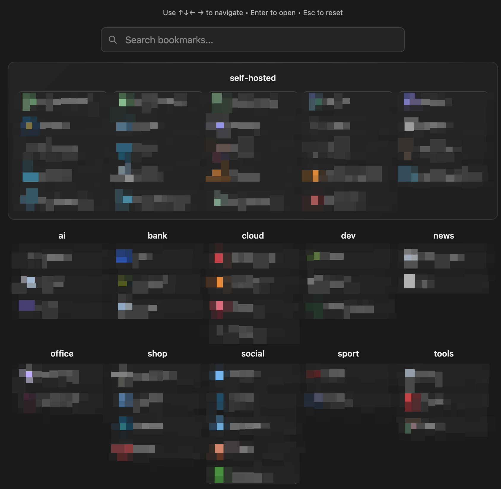

# Vue Startpage

A lightweight self-hosted startpage that connects to **Linkding** for bookmark management. Built with Vue.js 3 and nginx for fast, responsive bookmark browsing.

> **Linkding is the backbone** - This app requires a [Linkding](https://github.com/sissbruecker/linkding) instance to function.



## ✨ Features

- 🔖 **Real-time bookmark search** with debounced filtering
- 🏷️ **Tag-based sections** for organized layouts
- ⌨️ **Full keyboard navigation** (arrows, enter, escape)
- 🖼️ **Custom icons** via bookmark notes
- 📱 **Responsive design** across all devices
- 🐳 **Docker deployment** with single command

## 🚀 Quick Start

### Prerequisites
- Docker & Docker Compose
- Running [Linkding](https://github.com/sissbruecker/linkding) instance
- Linkding API token

### Deploy
```bash
git clone https://github.com/cloonix/startpage-vue.git
cd startpage-vue
cp .env.example .env
# Edit .env with your Linkding URL and API token
./build.sh
```

Access at `http://localhost:3000`

## ⚙️ Configuration

Create `.env` file:
```bash
PORT=3000
LINKDING_BASE_URL=https://your-linkding.com
LINKDING_API_TOKEN=your_api_token_here
```

Get your API token: Linkding → Settings → Integrations → REST API Token

## 📋 Usage

### Organize Bookmarks
- Tag bookmarks with `#startpage` + optional category tags
- Bookmarks are automatically organized by categories

### Custom Icons
Add to bookmark notes: `icon::https://example.com/favicon.png`

### Navigation
- Type to search • ↑↓ to navigate • Enter to open • Esc to clear

## 🐳 Docker Commands

```bash
docker compose up -d        # Start
docker compose down         # Stop
docker compose logs -f      # View logs
./build.sh                  # Rebuild
```

## 🔧 Architecture

- **Frontend**: Vue.js 3 (no build step)
- **Server**: nginx with caching
- **Backend**: Linkding API proxy
- **Deployment**: Docker container

## 📝 License

MIT License - see [LICENSE](LICENSE) file.